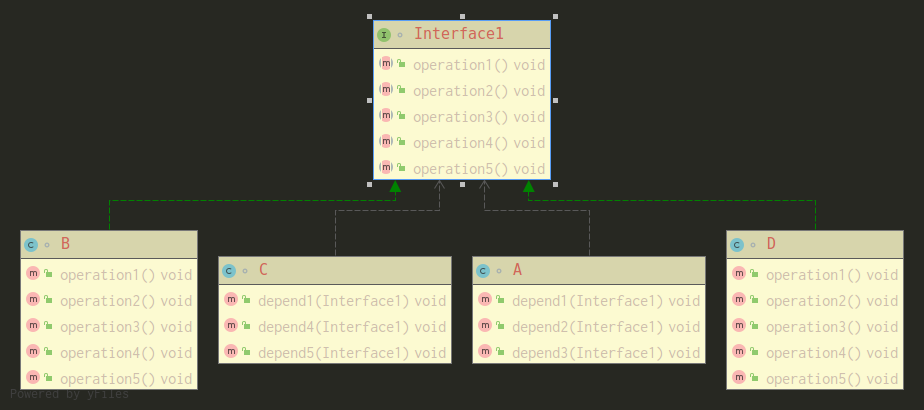
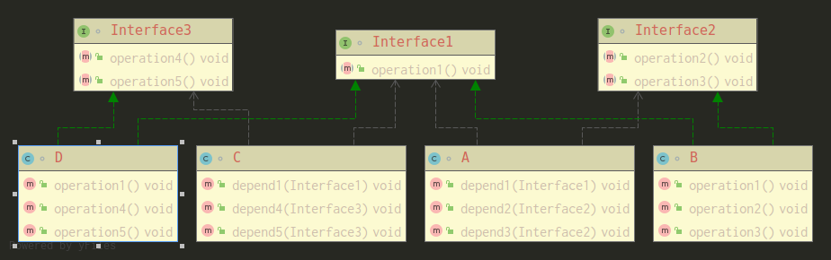

## 接口隔离原则

类A通过接口Interface1依赖类B，类C通过接口Interface1依赖类D，如果接口Interface1对于类A和类C来说不是最小接口，那么类A和类C要去实现他们不需要的方法，如下图：



对应代码如下： 
```java
interface Interface1 {
    void operation1();
    void operation2();
    void operation3();
    void operation4();
    void operation5();
}

class B implements Interface1{

    @Override
    public void operation1() {
        System.out.println("B 实现了 operation1");
    }

    @Override
    public void operation2() {
        System.out.println("B 实现了 operation2");
    }

    @Override
    public void operation3() {
        System.out.println("B 实现了 operation3");
    }

    @Override
    public void operation4() {
        System.out.println("B 实现了 operation4");
    }

    @Override
    public void operation5() {
        System.out.println("B 实现了 operation5");
    }
}


class D implements Interface1{

    @Override
    public void operation1() {
        System.out.println("D 实现了 operation1");
    }

    @Override
    public void operation2() {
        System.out.println("D 实现了 operation2");
    }

    @Override
    public void operation3() {
        System.out.println("D 实现了 operation3");
    }

    @Override
    public void operation4() {
        System.out.println("B 实现了 operation4");
    }

    @Override
    public void operation5() {
        System.out.println("D 实现了 operation5");
    }
}

class A{ //通过接口Interface1依赖B类但是只用到 1 2 3方法

    public void depend1(Interface1 interface1){
        interface1.operation1();
    }

    public void depend2(Interface1 interface1){
        interface1.operation2();
    }

    public void depend3(Interface1 interface1){
        interface1.operation3();
    }
}

class C{//通过接口Interface1依赖D类但是只用到 1 4 5方法

    public void depend1(Interface1 interface1){
        interface1.operation1();
    }

    public void depend4(Interface1 interface1){
        interface1.operation4();
    }

    public void depend5(Interface1 interface1){
        interface1.operation5();
    }
}
```
**使用者不应该依赖它不需要的接口，即一个类对另一个类的依赖应建立在最小的接口上，**所以按接口隔离原则我们应该这样处理：<br>
&emsp;&emsp;将接口Interface1拆分成独立的几个接口，类A和类C分别与他们建立依赖关系，也就是采用接口隔离原则。如下图：



代码如下：
```java
interface Interface1 {
    void operation1();

}

interface Interface2 {
    void operation2();
    void operation3();

}

interface Interface3{
    void operation4();
    void operation5();
}

class B implements Interface1,Interface2 {

    @Override
    public void operation1() {
        System.out.println("B 实现了 operation1");
    }

    @Override
    public void operation2() {
        System.out.println("B 实现了 operation2");
    }

    @Override
    public void operation3() {
        System.out.println("B 实现了 operation3");
    }

}


class D implements Interface1,Interface3 {

    @Override
    public void operation1() {
        System.out.println("D 实现了 operation1");
    }

    @Override
    public void operation4() {
        System.out.println("B 实现了 operation4");
    }

    @Override
    public void operation5() {
        System.out.println("D 实现了 operation5");
    }
}

class A{ //通过接口Interface1,Interface2依赖B类但是只用到 1 2 3方法

    public void depend1(Interface1 interface1){
        interface1.operation1();
    }

    public void depend2(Interface2 interface2){
        interface2.operation2();
    }

    public void depend3(Interface2 interface2){
        interface2.operation3();
    }
}

class C{//通过接口Interface1,Interface3依赖D类但是只用到 1 4 5方法

    public void depend1(Interface1 interface1){
        interface1.operation1();
    }

    public void depend4(Interface3 interface3){
        interface3.operation4();
    }

    public void depend5(Interface3 interface3){
        interface3.operation5();
    }
}
```