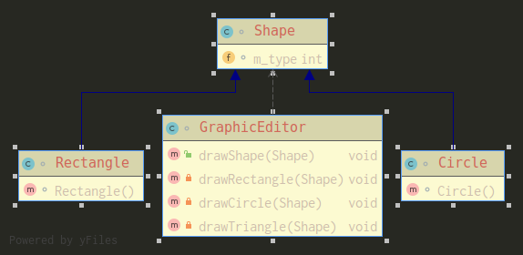
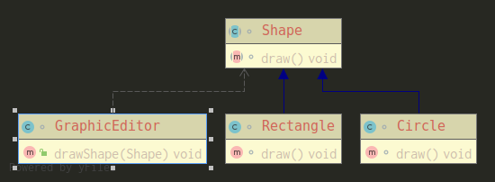

## 开闭原则
+ 一个软件实体如类，模块和函数应该对扩展开放（对提供方），对修改关闭（对使用方），用抽象构建框架，用实现扩展细节。
+ 当软件功能需要变化是，尽量通过扩展软件实体的行为来实现变化，而不是通过修改已有的代码来实现变化。
+ 编程中遵循其他原则，以及使用设计模式的目的就是遵循开闭原则

阅读如下设计：



代码实现：
```java

// 这是一个用于绘图的类
class GraphicEditor {
    // 接收Shape对象，然后根据type来绘制不同图形
    public void drawShape(Shape shape) {
        if (shape.m_type == 1) {
            drawRectangle(shape);
        } else if (shape.m_type == 2) {
            drawCircle(shape);
        }else if (shape.m_type == 3) {
            drawTriangle(shape);
        }
    }

    private void drawRectangle(Shape shape) {
        System.out.println("矩形");
    }

    private void drawCircle(Shape shape) {
        System.out.println("圆形");
    }

    private void drawTriangle(Shape shape) {
        System.out.println("三角形");
    }
}

class Shape {
    int m_type;
}

class Rectangle extends Shape {
    Rectangle() {
        super.m_type = 1;
    }
}

class Circle extends Shape {
    Circle() {
        super.m_type = 2;
    }
}
class Triangle extends Shape {
    Triangle() {
        super.m_type = 3;
    }
}

```

可以发现当我们要扩展功能，比如增加绘制三角形时，我们会改动到了使用方调用的drawShape方法，修改方法时难免会产生bug，这设计显然不合理。
下面我们遵循符合开闭原则来设计代码：



代码实现：
```java
// 这是一个用于绘图的类 (使用方)
class GraphicEditor {
    // 接收Shape对象，然后根据type来绘制不同图形
    public void drawShape(Shape shape) {
        shape.draw();
    }

}

abstract class Shape {
    abstract void draw();
}

class Rectangle extends Shape {

    @Override
    void draw() {
        System.out.println("矩形");
    }
}

class Circle extends Shape {

    @Override
    void draw() {
        System.out.println("圆形");
    }
}

class Triangle extends Shape {

    @Override
    void draw() {
        System.out.println("三角形");
    }
}
```
此时我们遵循了开闭原则，不会对使用方调用的方法做修改，同时又扩展了新功能。
